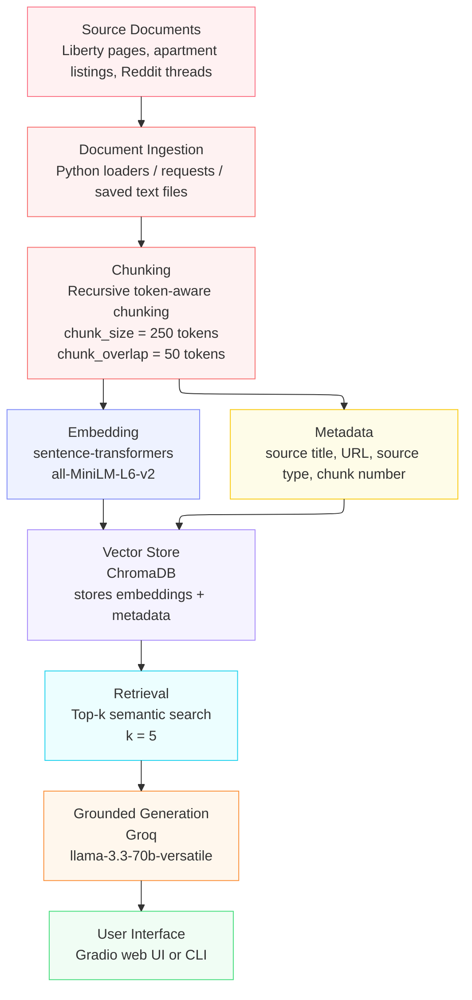

# Project 1 Planning: The Unofficial Guide

> Write this document before you write any pipeline code.
> Your spec and architecture diagram are what you'll use to direct AI tools (Claude, Copilot, etc.) to generate your implementation — the more specific they are, the more useful the generated code will be.
> Update the Retrieval Approach and Chunking Strategy sections if you change your approach during implementation.
> Update this file before starting any stretch features.

---

## Domain

Off Campus Living Liberty University

This is valuable information to have because Liberty University has certain requirements for off campus housing and offers some partnerships for student only housing. It provides a resource for students who don't want to fumble through all of the universities pages to find the relevant information as well as where to apply to live off campus. This domain will provide a tool that students and those new to commuter life to help understand what is needed, where to live, and other helpful information relevant to off-campus living.

---

## Documents

| #  | Source                                               | Description                                          | URL or location                                                                                                                              |
| -- | ---------------------------------------------------- | ---------------------------------------------------- | -------------------------------------------------------------------------------------------------------------------------------------------- |
| 1  | Housing Eligibility                                  | Information about requirements for off-campus housing| https://www.liberty.edu/residence-life/housing/eligibility/                                                                                  |
| 2  | Liberty Housing Selection / Apply to Live off campus | Res Life portal and off-campus application           | https://www.liberty.edu/residence-life/housing/                                                                                              |
| 3  | Transportation and Parking                           | Transportation and Parking that effects commuting    | https://www.liberty.edu/students/student-life/transportation-and-parking/                                                                    |
| 4  | Liberty New Commuter Information                     | Info and resources for new commuters                 | https://www.liberty.edu/students/student-life/commuter/new-commuter-info/                                                                    |
| 5  | The Oasis (University Sponsored off-campus)          | Listing for the Oasis                                | https://offcampushousing.liberty.edu/housing/property/the-oasis-student-housing/7x29svw                                                      |
| 6  | The Vue at College Square (Student Only Housing)     | Listing for the Vue                                  | https://offcampushousing.liberty.edu/housing/property/new-furnished-townhouse-at-the-vue-at-college-square-4br-with-private-baths/ocp60rjkns |
| 7  | Reddit Discussion about Oasis                        | Reddit Discussion about Oasis                        | https://www.reddit.com/r/LibertyUniversity/comments/1lqx8gv/oasis/                                                                           |
| 8  | Question about Oasis on r/libertyuniversity          | Question about Oasis on r/libertyuniversity          | https://www.reddit.com/r/LibertyUniversity/comments/13kf4f7/the_oasisa_good_place_to_live/                                                   |
| 9  | Housing Question r/libertyuniversity                 | Housing Question r/libertyuniversity                 | https://www.reddit.com/r/LibertyUniversity/comments/1erbbnt/housing/                                                                         |
| 10 | Off-Campus Living on r/libertyuniversity             | Off-Campus Living on r/libertyuniversity             | reddit.com/r/LibertyUniversity/comments/1ddr6an/offcampus_living/                                                                            |

---

## Chunking Strategy

**Chunk size:**
I will start with a chunk size of about 250 tokens.

**Overlap:**
50 tokens.

**Reasoning:**
I will use recursive token-aware chunking because my sources have different structures such as listings, University Online Resources, and Reddit Discussions about off-campus living.

This should be large enough to have related information grouped together while being able to be retrieved easily.

If chunks end up being too fragmented I will increase the chunk size and if it contains multiple unrelated topics I will reduce the size.

---

## Retrieval Approach

**Embedding model:**
I will use 'sentence-transformers/all-MiniLM-L6-v2' as my embedding model and store the embeddings in ChromaDB. I chose this model because its lightweight and runs locally. Its also designed for semantic search over sentence and paragraph sized text which works well for the University resources as well as the reddit threads.

**Top-k:**
I will retrieve the top 5 chunks from each query which should give enough context without overwhelming the LLM.

**Production tradeoff reflection:**
Semantic search can find relevant chunks even when the query does not use the exact words that are found in the document.

---

## Evaluation Plan

| # | Question                                                                                                                       | Expected answer                                                                                                                                                                                                                                                                                                                                                                        |
| - | ------------------------------------------------------------------------------------------------------------------------------ | -------------------------------------------------------------------------------------------------------------------------------------------------------------------------------------------------------------------------------------------------------------------------------------------------------------------------------------------------------------------------------------- |
| 1 | I am a freshman at Liberty University and want to move off campus next spring. Am I automatically eligible to live off campus? | No, A freshmen is not automatically eligible just because they wish to move off campus. The system should explain the requirements for unmarried students under 21 are usually required to live on campus unless they meet the expectations such as living with a parent or with a sibling who is at least 21 and should direct the user to the Res Life Portal to apply for approval. |
| 2 | I want to live off campus but I do not have a car. What transportation options could help me get to campus?                    | The system should mention Liberty bus routes and Greater Lynchburg Transit company as an external transit as well as apartment specific shuttle access where supported such as one from the Oasis listing.                                                                                                                                                                             |
| 3 | What does The Oasis offer for Liberty students, and how much does it cost per bedroom?                                         | The system should identify The Oasis as student housing with 2-6 bedroom options, 12 month leases, by-the-bed leasing, roommate matching, LU Shittle service, and rent listed around $450-855 per bedroom depending on the floor plan. It should not claim that the price is guaranteed.                                                                                               |
| 4 | How does The Vue at College Square compare to The Oasis for a student who wants to be close to campus?                         | The system should say The Vue at College Square is listed closer to Liberty's Main campus than the Oasis. It should also mention how they both use roommate matching and by-the-bed leasing. It should also show the difference it the total rent cost.                                                                                                                                |
| 5 | What do student discussions say about living at The Oasis as a graduate student or older student?                              | The system should give a mixed answer without giving a clear consensus. It should provide comments from students who mention that the Oasis is loud and Party Oriented as well as comments from students that say that they haven't had any issues with sound or parties.                                                                                                              |

---

## Anticipated Challenges

1. Noisy and inconsistent source formats (which is the reason for choosing recursive chunking)

2. Conflicting information from official sources as well as student reported experiences on the reddit threads

3. Chunking mixed-format documents without losing context

4. Retrieval returning incomplete or inconsistent chunks

---

## Architecture

---

## AI Tool Plan

**Milestone 3 — Ingestion and chunking:**
I plan to use AI tools as a coding assistant and debugging partner that will not generate an entire project without review. I will use my planning.md sections as context so the AI Output is based on my actual goals and strategies. I plan to use Claude Code to assist in some of the recursive chunking logic.

**Milestone 4 — Embedding and retrieval:**
I plan to use Claude Code to help with my implementation of ChromaDB.

**Milestone 5 — Generation and interface:**
I plan to use AI tools as a coding assistant and debugging partner that will not generate an entire project without review.
